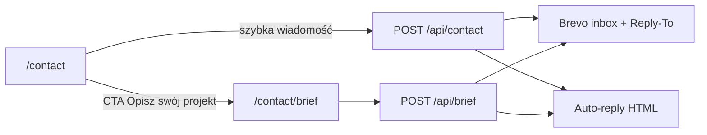

# Brief projektu — analiza i rekomendacja

Status: **wdrożone**. Specyfikacja i uzasadnienie decyzji poniżej.

Źródło zadania: instrukcja agenta (usunięta po sporządzeniu raportu). Ten plik jest specyfikacją do wdrożenia.

---

## A. Analiza obecnej wizytówki

### Jak prezentowane są usługi

Nie ma osobnej strony `/services`, pakietów ani cennika. Oferta wynika z copy i portfolio:

| Powierzchnia | Przekaz                                                                          | Źródło                                           |
| ------------ | -------------------------------------------------------------------------------- | ------------------------------------------------ |
| Landing      | Produkty cyfrowe, strony i aplikacje — od koncepcji po wdrożenie                 | `messages/*/landing.tagline`                     |
| Kim jestem   | AI Document; strony firmowe i landingi (SEO + motion); Lyamo i panele operacyjne | `about.buildingItems.*`                          |
| Projekty     | Filtry **Strony internetowe** / **Aplikacje**                                    | `src/content/projects.ts` (`websites` \| `apps`) |
| Kontakt      | „Masz pomysł na produkt, stronę lub współpracę?”                                 | `contact.lead`                                   |
| CV           | Full-stack: aplikacje, SaaS/AI, strony komercyjne                                | `src/content/cv.ts`                              |

Dowód klientcki stron: case study AK Gebäudeservice (end-to-end: design, domena, hosting). Dowód aplikacji: AI Document, Lyamo.

Klucz: wizytówka pozycjonuje Piotra jako inżyniera produktu / foundera, który bierze też zlecenia — **nie jako agencję tylko od stron WWW**.

### Kontakt

Trasa: `/{locale}/contact` ([`src/app/[locale]/contact/page.tsx`](../src/app/[locale]/contact/page.tsx)).

- Desktop: dwukolumnowy układ, `md:h-(--site-main-h)` + `md:overflow-y-auto` — strona jest zaprojektowana tak, **żeby nie scrollować okna**.
- Lewa kolumna: tytuł, lead, e-mail bezpośredni (`kontakt@piotrkulbacki.com`), lokalizacja Remote · Berlin / EU.
- Prawa kolumna: formularz.
- Nav: 4 pozycje (Kim jestem, Projekty, CV/Doświadczenie, Kontakt) w sidebarze i mobile tab barze. **Piąta pozycja zepsuje układ mobile.**

### Obecny formularz

[`src/components/contact/ContactForm.tsx`](../src/components/contact/ContactForm.tsx) + [`src/app/api/contact/route.ts`](../src/app/api/contact/route.ts).

| Pole      | Wymagane           | Uwagi                                     |
| --------- | ------------------ | ----------------------------------------- |
| Imię      | tak                | 2–80 znaków                               |
| E-mail    | tak                |                                           |
| Telefon   | nie                | max 40                                    |
| Wiadomość | tak                | 10–4000                                   |
| `website` | honeypot           | ukryte; wypełnione → cichy `{ ok: true }` |
| locale    | auto               | z `useLocale()`                           |
| Turnstile | gdy skonfigurowany | widget dark / flexible                    |

Przepływ: walidacja Zod (klient **i** serwer — schemat zduplikowany) → `POST /api/contact` → rate limit `5/60s` in-memory (`contact:{ip}`) → honeypot → Turnstile → Brevo.

Maile ([`src/lib/email/`](../src/lib/email/)):

1. **Inbox** na `CONTACT_TO_EMAIL` — HTML z `wrapEmailHtml`, CTA „Odpowiedz w szablonie” (podpisany link na `/{locale}/reply`), `replyTo` = nadawca.
2. **Auto-reply** do klienta — potwierdzenie + cytat wiadomości; błąd auto-reply **nie** psuje requestu.

UX: toast (Sonner) wyłącznie — bez błędów pod polami. Submit: `loading` + disabled + spinner na `Button`. Sukces: toast + **redirect na `/`**.

Zgoda: nota „Wysyłając formularz akceptujesz politykę prywatności” + link. Brak checkboxa marketingowego. Podstawa w privacy: art. 6 ust. 1 lit. b lub f RODO.

### Komponenty do ponownego użycia

| Element                                              | Ścieżka / wzorzec                                    |
| ---------------------------------------------------- | ---------------------------------------------------- |
| `Button` (primary/secondary, loading, cursor)        | `src/components/ui/Button.tsx`                       |
| Styl pól (`fieldClassName`, `RequiredMark`, `gap-3`) | `ContactForm.tsx`                                    |
| `Reveal` + `prefers-reduced-motion`                  | `src/components/motion/Reveal.tsx`                   |
| Turnstile                                            | `@marsidev/react-turnstile` + `src/lib/turnstile.ts` |
| Rate limit                                           | `src/lib/rate-limit.ts`                              |
| Layout maili PK                                      | `src/lib/email/layout.ts`                            |
| Copy maili (5 locale)                                | `messages/*/email`                                   |
| Toast                                                | `AppToaster` (Sonner)                                |
| Privacy link                                         | `Link` z `@/i18n/navigation`                         |

Brak: wspólnych `Input` / checkbox / radio; `sessionStorage` w projekcie; testów E2E formularza.

### i18n, prawne, SEO

- Locale: `pl`, `en`, `de`, `es`, `uk`; prefix always; default EN. Zakaz hardkodu UI.
- Privacy opisuje **tylko** pola kontaktu — brief wymaga aktualizacji copy.
- AGB / regulamin: nadal niepotrzebny (brak automatycznego zawierania umów).
- Sitemap: `getIndexableRoutes()` w [`src/lib/seo.ts`](../src/lib/seo.ts) — nowa trasa musi tam wejść.
- Analityka: Vercel + GA4 dopiero po zgodzie w bannerze; brak Meta Pixel. Brief nie dodaje trackerów.

---

## B. Rekomendacja

Instrukcja proponowała 14 kroków **pod** formularzem kontaktowym i brief **tylko o stronie**. Po analizie: za długie, za wąskie i psuje layout Kontaktu.



### Gdzie umieścić

Osobna podstrona **`/{locale}/contact/brief`**. Na Kontaktcie tylko blok CTA — nie drugi formularz.

Dlaczego nie pod formularzem:

1. Kontakt na desktopie jest zablokowany wysokością viewportu.
2. Multi-step potrzebuje pełnej uwagi i paska postępu.
3. Dwie intencje (szybka wiadomość vs. brief) muszą być rozdzielone.

### Nazwy

| Element                       | Rekomendacja                | Odrzucone                                                |
| ----------------------------- | --------------------------- | -------------------------------------------------------- |
| Nagłówek sekcji na Kontaktcie | **Planujesz projekt?**      | „Planujesz stronę internetową?” (za wąskie)              |
| CTA                           | **Opisz swój projekt**      | „Zamów stronę”, „Wypełnij brief” (żargon / transakcyjne) |
| Tytuł podstrony               | ten sam zwrot + krótki lead | —                                                        |

Copy CTA ma być zgodne z `contact.lead` (produkt, strona, współpraca) i z `about.buildingItems`.

### Umiejscowienie CTA na Kontaktcie

1. **Główne:** lewa kolumna, pod e-mailem / lokalizacją — nie rozsadza prawej kolumny z formularzem.

**Bez** nowej pozycji w sidebarze / tab barze.

### Przepływ użytkownika

1. Kontakt → wybór ścieżki.
2. Brief: 6 kroków, pasek „Krok n z 6”, Wstecz / Dalej. Nowy krok zaczyna się od góry (`#site-scroll`).
3. Szkic w `sessionStorage` + ostrzeżenie `beforeunload`; czyszczenie po sukcesie.
4. Krok 6: podsumowanie (można wrócić i poprawić) → Turnstile → submit.
5. Sukces: **ekran na stronie briefu + toast**. Bez natychmiastowego redirectu na home (większa inwestycja czasu niż przy kontakcie).

### Zakres: nie tylko strony

Pierwszy krok: **rodzaj projektu** (`website` / `app` / `other`). Dalsze pytania warunkowe. Uniwersalny brief „Opisz swój projekt”, nie osobny formularz „tylko WWW”.

---

## C. Finalna struktura formularza

Wymagane tylko to, co potrzeba do rozpoczęcia rozmowy: imię, e-mail, rodzaj, główny cel, krótki opis. Reszta z jawnym „opcjonalnie”.

| Krok | Pytanie                                      | Typ pola                                                                | Wymagane?               | Warunek                                    |
| ---- | -------------------------------------------- | ----------------------------------------------------------------------- | ----------------------- | ------------------------------------------ |
| 1    | Imię                                         | tekst                                                                   | Tak                     | —                                          |
| 1    | Firma / marka                                | tekst                                                                   | Nie                     | —                                          |
| 1    | E-mail                                       | email                                                                   | Tak                     | —                                          |
| 1    | Telefon                                      | tel                                                                     | Nie                     | —                                          |
| 1    | Obecna strona                                | URL                                                                     | Nie                     | —                                          |
| 1    | Rodzaj projektu                              | radio: strona / aplikacja / nie wiem                                    | Tak                     | —                                          |
| 2    | Główne cele                                  | checkboxy (min. 1)                                                      | Tak                     | —                                          |
| 2    | Co chcesz osiągnąć?                          | textarea                                                                | Tak                     | —                                          |
| 3    | Podstrony                                    | checkboxy                                                               | Nie                     | rodzaj = strona                            |
| 3    | Funkcje aplikacji                            | checkboxy                                                               | Nie                     | rodzaj = aplikacja                         |
| 3    | Zakres — inne / nie wiem                     | checkboxy wspólne                                                       | Nie                     | zawsze na kroku 3                          |
| 3    | Co jest szczególnie ważne?                   | textarea                                                                | Nie                     | —                                          |
| 4    | Logo / identyfikacja                         | radio: tak / częściowo / nie                                            | Nie                     | —                                          |
| 4    | Zdjęcia                                      | radio: tak / częściowo / nie                                            | Nie                     | —                                          |
| 4    | Teksty                                       | radio: tak / częściowo / nie                                            | Nie                     | —                                          |
| 4    | Linki do inspiracji                          | textarea (URL)                                                          | Nie                     | —                                          |
| 4    | Przebudowa istniejącej strony                | radio                                                                   | Nie                     | wypełniony URL w kroku 1                   |
| 4    | Zachować treści / migracja / URL i redirecty | textarea + checkboxy                                                    | Nie                     | wypełniony URL w kroku 1                   |
| 5    | Języki                                       | checkboxy: PL, EN, DE, ES, UK, inny                                     | Nie                     | —                                          |
| 5    | Gotowe tłumaczenia?                          | radio: tak / częściowo / nie                                            | Nie                     | —                                          |
| 5    | Integracje                                   | checkboxy: Maps, Analytics/SEO, social, płatności, CRM/newsletter, inne | Nie                     | —                                          |
| 5    | Termin uruchomienia                          | tekst (data / wydarzenie)                                               | Nie                     | —                                          |
| 6    | Podsumowanie                                 | przegląd (read-only + Wstecz)                                           | —                       | —                                          |
| 6    | Turnstile                                    | captcha                                                                 | Tak, gdy skonfigurowany | —                                          |
| 6    | Nota privacy                                 | tekst + link `/privacy`                                                 | informacyjna            | jak kontakt — bez checkboxa marketingowego |

### Opcje celów (krok 2, wielokrotny)

Pozyskiwanie klientów · prezentacja usług · sprzedaż · zapytania · wizerunek · portfolio · rezerwacje · panel operacyjny · informowanie klientów · inne.

### Opcje podstron (krok 3, tylko strona)

Start · O nas · Oferta / usługi · Realizacje · Cennik · Opinie · FAQ · Blog · Galeria · Kontakt · Formularz · Mapa · inne.

### Opcje funkcji (krok 3, tylko aplikacja)

Logowanie / rejestracja · panel klienta · płatności · CMS / blog · rezerwacje / kalendarz · newsletter · wyszukiwarka · integracje API · inne · nie wiem — potrzebuję konsultacji.

---

## D. Sugestie zmian względem instrukcji

### Dodać

- Wybór **strona / aplikacja / nie wiem** na starcie.
- Cel „panel operacyjny” (oferta Lyamo / dashboardy).
- Ekran sukcesu na miejscu (nie tylko toast + home).
- Szkic w `sessionStorage` + `beforeunload`.
- Wspólny schemat Zod (dziś kontakt duplikuje schema w kliencie i API).

### Usunąć

- 14 kroków (zostaje 6).
- Osobny krok „Firma i oferta” — treść w opisie celu.
- Osobny krok „Najważniejsze wymagania” — pokrywa się z opisem + „co ważne”.
- Duplikat danych kontaktowych na końcu.
- GSC jako osobny checkbox (wchodzi w Analytics/SEO).
- Osobne „formularz wyceny” obok „formularz kontaktowy”.
- Numeric budget i opcja „nie mam budżetu”.
- Zgody marketingowe / newsletter „na zapas”.
- Brief wyłącznie o stronach WWW.

### Połączyć

- Zakres strony + funkcjonalności → jeden krok, rozgałęziony typem.
- Integracje + języki + termin → jeden krok.
- Istniejąca strona → pytania warunkowe w kroku materiałów, nie osobny etap.

### Warunkowo

- Podstrony vs funkcje aplikacji — od rodzaju z kroku 1.
- Pytania o przebudowę / migrację — tylko gdy jest URL.
- Turnstile — tylko gdy jest site key (jak kontakt).

### Zbyt długie (świadomie skrócone)

Pełna lista 14 kroków z instrukcji. Klient ma dokończyć brief w kilka minut; szczegóły i tak wychodzą w mailu / rozmowie.

---

## E. Plan techniczny

### Routing i SEO

- Strona: `src/app/[locale]/contact/brief/page.tsx`.
- Dodać `/contact/brief` do `getIndexableRoutes()` (priorytet ~0.6, `monthly`).
- `buildPageMetadata` z namespace `brief` (`title` + `lead`).
- Wspólny OG (logo) — bez nowej grafiki.

### Komponenty (propozycja)

```
src/components/contact/brief/
  BriefForm.tsx          # orkiestracja kroków, persist, submit
  BriefProgress.tsx      # „Krok n z 6”
  BriefStepNav.tsx       # Wstecz / Dalej / Wyślij
  BriefChoiceGroup.tsx   # radio / checkbox w stylu fieldClassName
  BriefSummary.tsx
  BriefSuccess.tsx
```

Na Kontaktcie: mały blok CTA (nie przebudowywać pól kontaktu).

### State

- React state w `BriefForm` (client).
- Persist: `sessionStorage` klucz np. `pk_brief_draft` (JSON bez tokenu Turnstile).
- Krok w stanie, nie w query (PII).
- Po sukcesie: clear storage.

### Walidacja

- Jeden schemat Zod w `src/lib/schemas/brief.ts` (import klient + API).
- Per-krok: walidacja tylko pól tego kroku przy „Dalej”.
- Krok 3–5: puste = OK.
- Limity długości analogiczne do kontaktu (textarea max ~4000 łącznie na pole).

Przy okazji (nie blokuje briefu): wyciągnąć schema kontaktu do `src/lib/schemas/contact.ts`, żeby przestać duplikować.

### API / dane / e-maile

- `POST /api/brief` — **osobny** handler, ten sam stos bezpieczeństwa.
- Rate limit key: `brief:{ip}` (nie dzielić kubełka z kontaktem).
- Honeypot: to samo pole `website`.
- Brak bazy — uporządkowanie = HTML maila (sekcje jak kroki) + plain text. Żadnego CMS / inboxa w appce (zakaz autonomicznego rozszerzania zakresu).
- Nowe buildery: `buildBriefInboxEmail`, `buildBriefAutoReplyEmail` na `wrapEmailHtml`.
- Inbox: subject np. „Brief projektu: {name}”; CTA „Odpowiedz w szablonie”; `replyTo` = klient.
- Auto-reply: podziękowanie + skrót odpowiedzi (cele, rodzaj, opis) + informacja 1–2 dni robocze.
- Copy: `messages/*/email.briefInbox` i `email.briefAutoReply` (5 locale).

Env: te same `BREVO_*`, `CONTACT_TO_EMAIL`, Turnstile — bez nowych sekretów.

### Bezpieczeństwo i prywatność

- Turnstile + honeypot + Zod + rate limit jak kontakt.
- Privacy: rozszerzyć `privacy.formBody` **albo** dodać `privacy.briefHeading` / `briefBody` (5 locale) — imię, e-mail, opcjonalny telefon, treść briefu; Brevo; Turnstile; bez marketingu.
- Szkic w `sessionStorage` nie wymaga cookie. Nie opisywać jako nowej kategorii cookies.
- AGB nadal nie.

### i18n

- Namespace `brief` w `messages/{pl,en,de,es,uk}.json`: kroki, etykiety, opcje, postęp, walidacja, sukces, błędy (reuse tonu `contact.*`).
- Opcje celów / podstron / funkcji jako klucze, nie hardkod.
- Etykiety a11y (postęp, grupa radio) też przez i18n.

### Analityka

Bez nowych trackerów. Opcjonalnie później (po zgodzie): event GA `brief_start` / `brief_submit` — **nie** w v1, żeby nie mieszać z Consent Mode.

### a11y / UX

- Semantyczny `<form>`, `fieldset` + `legend` dla grup, `<label>` przy każdym polu.
- Wymagane: `*` jak w kontakcie + `aria-required`.
- Focus ring istniejący; `text-base` na inputach (iOS zoom).
- Klawiatura: tab przez opcje, Enter nie wysyła w krokach 1–5.
- Screen reader: `aria-live` na komunikacie kroku; toast na błąd/sukces.
- Mobile-first: opcje jako duże tap targety, nie natywny `<select>` wielokrotny; progress czytelny w jednej linii; sticky nav kroków na dole na wąskim ekranie (nad tab barem — `padding-bottom` jak reszta appki).
- `prefers-reduced-motion` na przejściach kroków.

### Testy

Brak E2E w repo (checklista: Lighthouse + formularz E2E nadal otwarte). v1: `format:check`, `lint`, `typecheck`, `build` + ręczny smoke (Turnstile, honeypot, 429, inbox, auto-reply, 5 locale). E2E briefu razem z kontaktem — osobna zgoda.

---

## F. Plan wdrożenia

Nie zmieniać pól ani API istniejącego formularza kontaktowego — tylko CTA.

| Etap | Zakres                                                   | Zależności |
| ---- | -------------------------------------------------------- | ---------- |
| 0    | Ten dokument zaakceptowany                               | —          |
| 1    | Schema Zod + namespace `brief` + klucze maili (5 locale) | —          |
| 2    | UI multi-step, persist, a11y, success screen             | etap 1     |
| 3    | `POST /api/brief` + szablony HTML inbox/auto-reply       | etap 1     |
| 4    | CTA na Kontaktcie; privacy; sitemap `/contact/brief`     | etap 2–3   |
| 5    | Prettier, lint, typecheck, build; smoke maile + mobile   | etap 4     |

Po etapie 5: ten plik i `PROJECT_CHECKLIST.md` zaktualizowane (status: wdrożone).

---

## Najważniejsze decyzje (skrót)

1. Osobna strona `/contact/brief`, nie drugi formularz pod kontaktem.
2. CTA **„Opisz swój projekt”**, sekcja **„Planujesz projekt?”**.
3. Brief uniwersalny (strona / aplikacja / nie wiem), nie tylko WWW.
4. 6 kroków zamiast 14; większość pól opcjonalna.
5. Budżet jakościowy — bez kwot.
6. Ten sam stos: Turnstile, honeypot, rate limit, Brevo, toast, i18n.
7. Dane tylko w mailu — bez bazy.
